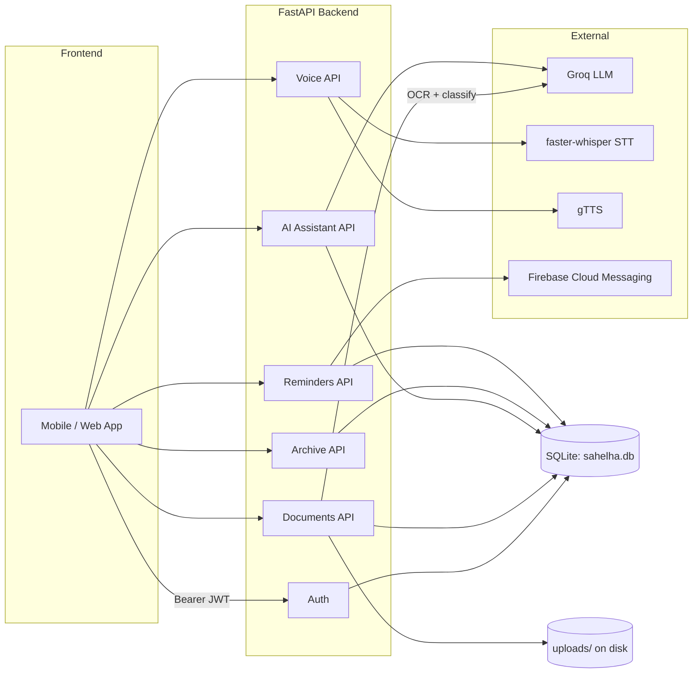

# Sahelha Backend — Complete API Documentation

This is the single reference the frontend needs to connect to every endpoint
this backend exposes. It documents what the backend does, how auth works,
every route (request shape, response shape, status codes), the exact data
you'll get back for documents/reminders/etc., and ready-to-use request
examples in `curl` and JavaScript.

> Looking for the narrative "how does the whole app flow together" version
> instead? See [FRONTEND_GUIDE.md](FRONTEND_GUIDE.md). This document is the
> exhaustive per-endpoint reference.

---

## Table of contents

1. [What this backend does](#1-what-this-backend-does)
2. [Tech stack & architecture](#2-tech-stack--architecture)
3. [Getting started](#3-getting-started)
4. [Authentication](#4-authentication)
5. [Documents](#5-documents)
6. [AI Assistant (ask about a document)](#6-ai-assistant-ask-about-a-document)
7. [Voice (speech-to-text / text-to-speech)](#7-voice-speech-to-text--text-to-speech)
8. [Archive & Search](#8-archive--search)
9. [Reminders](#9-reminders)
10. [Legacy / public endpoints](#10-legacy--public-endpoints)
11. [Uploaded files & audio (static serving)](#11-uploaded-files--audio-static-serving)
12. [Error handling reference](#12-error-handling-reference)
13. [Data reference: document_type, tags, entities](#13-data-reference-document_type-tags-entities)
14. [Environment variables](#14-environment-variables)
15. [Quick-reference endpoint table](#15-quick-reference-endpoint-table)

---

## 1. What this backend does

Sahelha helps a user deal with Egyptian government paperwork without needing
to read or type. In one sentence: **take a photo of a document → backend OCRs
it and explains it in plain Arabic → user can ask questions about it by voice
→ the app reminds them before it expires → everything lands in a searchable
archive.**

Concretely, the backend is a FastAPI service that:

- Authenticates users with email/password (JWT bearer tokens).
- Accepts a photo upload, runs OCR (EasyOCR) on it, then sends the extracted
  text to an LLM (Groq/Llama) which classifies the document type, writes an
  Arabic summary, and extracts entities (name, address, governorate, dates,
  amounts, expiry date). This runs **in the background** — the upload
  response returns instantly, and the frontend polls for the result.
- Automatically creates a reminder if an expiry date was found.
- Lets the user ask questions about a specific document (typed or spoken);
  answers come back as both text and synthesized speech (Arabic TTS).
- Transcribes standalone voice recordings (STT) and synthesizes arbitrary
  text to speech (TTS).
- Provides full-text search and tag filtering over a user's documents, plus
  QR-code sharing.
- Manages reminders (auto-created from expiry dates, or created manually) and
  pushes them via Firebase Cloud Messaging when due.
- Also ships a handful of **older, pre-auth "legacy" endpoints** (a static
  services/offices catalogue and a canned keyword-bot chat) — see
  [§10](#10-legacy--public-endpoints) for why you probably don't need them.

---

## 2. Tech stack & architecture

- **Framework:** FastAPI (Python), served by Uvicorn.
- **Database:** a single SQLite file (`sahelha.db`), schema/migrations applied
  automatically on startup — no separate migration step.
- **Auth:** hand-rolled HS256 JWT (stdlib `hmac`/`hashlib`, no external JWT
  library) + PBKDF2-SHA256 password hashing.
- **OCR:** EasyOCR with image preprocessing (upscale, CLAHE, denoise, sharpen).
- **LLM analysis & Q&A:** Groq (Llama models).
- **STT:** faster-whisper ("small" model, CPU, Arabic).
- **TTS:** gTTS (Google Text-to-Speech), Arabic.
- **Search:** SQLite FTS5 full-text index over document type/summary/OCR
  text/tags.
- **File storage:** local disk under `uploads/`, served back at `/uploads/...`
  via FastAPI's `StaticFiles`.
- **Background jobs:** FastAPI `BackgroundTasks` for the OCR+AI pipeline; a
  daemon thread polling on an interval for due reminders (no Celery/Redis).



---

## 3. Getting started

- **Base URL:** wherever it's deployed (e.g. `https://<service>.onrender.com`)
  or `http://localhost:8000` locally.
- **Interactive docs:** `/docs` (Swagger UI) and `/openapi.json` are always
  live — great for trying a request by hand before wiring up UI.
- **Auth header:** every endpoint except register/login/health/legacy needs:
  ```
  Authorization: Bearer <access_token>
  ```
- **Content types:** JSON endpoints send `application/json`; file/voice/photo
  endpoints send `multipart/form-data`.
- **CORS:** only origins listed in the backend's `ALLOWED_ORIGINS` env var are
  allowed (defaults to `http://localhost:3000,http://localhost:8081`). If the
  frontend gets CORS errors in the browser console, this is the first thing
  to check with whoever runs the backend.
- **Health checks** (no auth):
  - `GET /health` → `{"status": "ok"}`
  - `GET /api/ready` → `{"status": "ready", "database": "ok"}`, or `503` if
    the database isn't reachable.

---

## 4. Authentication

Auth is JWT bearer-token based. There is **no OAuth/social login** and
**no `/refresh` endpoint** — a `refresh_token` is issued but nothing consumes
it yet. The access token is valid for `ACCESS_TOKEN_EXPIRE_HOURS` (24h by
default); when it expires, send the user back to the login screen.

### `POST /api/auth/register`

No auth required.

**Request body (JSON):**
| Field | Type | Required | Notes |
|---|---|---|---|
| `email` | string | yes | must contain `@` and a `.` after it; lowercased/trimmed server-side |
| `password` | string | yes | min length 6 |
| `full_name` | string \| null | no | |
| `phone` | string \| null | no | |

```bash
curl -X POST https://<base>/api/auth/register \
  -H "Content-Type: application/json" \
  -d '{"email":"user@example.com","password":"secret123","full_name":"محمد","phone":"0100000000"}'
```

**Response `200`:**
```json
{
  "access_token": "eyJhbGciOi...",
  "refresh_token": "3f9a...",
  "token_type": "bearer",
  "user": {
    "id": 1,
    "email": "user@example.com",
    "full_name": "محمد",
    "phone": "0100000000",
    "created_at": "2026-07-13T10:00:00+00:00"
  }
}
```

**Errors:** `400` — email already registered, or fails validation (pydantic
422 for malformed body, `400` with `{"detail": "Email already registered"}`
for a duplicate).

### `POST /api/auth/login`

```json
{ "email": "user@example.com", "password": "secret123" }
```
Same response shape as register. `401 {"detail": "Invalid credentials"}` on
wrong email/password.

### `GET /api/auth/me` 🔒

Returns the current user object (same shape as `user` above). `401` if the
token is missing/invalid/expired.

```js
fetch(`${BASE_URL}/api/auth/me`, {
  headers: { Authorization: `Bearer ${accessToken}` },
});
```

### `PUT /api/auth/fcm-token` 🔒

Call this once the app has obtained a Firebase Cloud Messaging device token,
so reminder push notifications can actually be delivered.

```json
{ "fcm_token": "the-device-fcm-token" }
```
Response: `{"message": "FCM token updated"}`.

---

## 5. Documents

This is the core feature: upload a photo → backend OCRs + analyzes it in the
background → poll until done.

### `POST /api/documents/upload` 🔒

`multipart/form-data`, field name **`file`** = an image (`image/*` content
type — anything else is rejected).

```js
const form = new FormData();
form.append("file", imageFile); // File/Blob from <input type="file"> or camera

const res = await fetch(`${BASE_URL}/api/documents/upload`, {
  method: "POST",
  headers: { Authorization: `Bearer ${accessToken}` }, // do NOT set Content-Type manually
  body: form,
});
const { doc_id, status } = await res.json();
```

**Response `200`** — returned **immediately**, before OCR/AI finishes:
```json
{ "doc_id": 42, "status": "processing", "message": "Document received, processing started" }
```

**Errors:** `400 {"detail": "Only image files are accepted"}` if the content
type doesn't start with `image/`.

OCR + AI analysis then run **in the background**. The frontend must poll
`GET /api/documents/{doc_id}` (every 2–3 seconds is reasonable) until
`status` becomes `"done"` or `"failed"`.

```js
async function pollDocument(docId, accessToken, { intervalMs = 2500, timeoutMs = 60000 } = {}) {
  const start = Date.now();
  while (Date.now() - start < timeoutMs) {
    const res = await fetch(`${BASE_URL}/api/documents/${docId}`, {
      headers: { Authorization: `Bearer ${accessToken}` },
    });
    const doc = await res.json();
    if (doc.status === "done" || doc.status === "failed") return doc;
    await new Promise((r) => setTimeout(r, intervalMs));
  }
  throw new Error("Timed out waiting for document processing");
}
```

### `GET /api/documents/` 🔒

Lists the caller's documents, most recent first. No pagination — returns all
of them.

```json
[
  {
    "id": 42,
    "status": "done",
    "doc_type": "national_id",
    "ai_summary": "بطاقة تحقيق الشخصية لشخص يسمى...",
    "ocr_text": "raw OCR text as extracted...",
    "entities": { "name": "محمد أحمد", "address": "القاهرة", "governorate": "القاهرة", "national_number": "29001011234567" },
    "dates": ["01/01/2020", "01/01/2027"],
    "amounts": [],
    "expiry_date": "2027-01-01",
    "tags": ["national_id", "arabic", "identity", "government"],
    "image_url": "/uploads/1/abcd1234.jpg",
    "created_at": "2026-07-13T10:05:00+00:00"
  }
]
```

### `GET /api/documents/{doc_id}` 🔒

Same document shape, single item. `404 {"detail": "Document not found"}` if
it doesn't exist or belongs to a different user (ownership is enforced by
scoping the SQL query to the caller's `user_id` — a 404, not a 403, is
returned either way so existence isn't leaked).

### `DELETE /api/documents/{doc_id}` 🔒

Deletes the document row (cascades to its `document_fields`) and removes the
image file from disk. `{"message": "Deleted"}`, or `404` if not
found/not owned.

### Document field reference

| Field | Type | Meaning |
|---|---|---|
| `id` | int | document id |
| `status` | `"processing"` \| `"done"` \| `"failed"` | pipeline state |
| `doc_type` | string \| null | see [§13](#13-data-reference-document_type-tags-entities); `null` while still processing |
| `ai_summary` | string \| null | plain-Arabic summary; `null` until done |
| `ocr_text` | string \| null | raw text as read from the image |
| `entities` | object | `{name, address, governorate}` always present as keys once analyzed (empty strings if not found); `national_number` added when it's a national ID and the number could be cropped/read separately |
| `dates` | string[] | every date-like string found in the text |
| `amounts` | string[] | every monetary amount found |
| `expiry_date` | string \| null | best-guess expiry/validity date, in whatever format it appeared in the source text (not normalized — parse defensively) |
| `tags` | string[] | short Arabic/English labels, see [§13](#13-data-reference-document_type-tags-entities) |
| `image_url` | string \| null | **relative** path — prefix with the backend's base URL to render (``) |
| `created_at` | ISO datetime string | |

**While `status === "processing"`:** `doc_type`, `ai_summary`, `ocr_text` are
`null`, and `entities`/`dates`/`amounts`/`tags` are empty (`{}`/`[]`).

**If `status === "failed"`:** OCR produced no text at all (e.g. blurry photo,
unsupported format edge case) — `ai_summary` will be a generic "couldn't read
this" message; consider prompting the user to retake the photo.

---

## 6. AI Assistant (ask about a document)

The real AI Q&A feature — ask a question (typed or spoken) about a specific
document and get an Arabic answer back as text **and** speech, with
conversation memory across turns.

### `POST /api/ai/ask` 🔒

`multipart/form-data` fields:

| Field | Type | Required | Notes |
|---|---|---|---|
| `document_id` | int | yes | must belong to the caller and already have OCR text (i.e. `status: "done"`) |
| `session_id` | string | no | pass back the `session_id` from a previous response to continue that conversation; omit to start a new one |
| `question` | string | one of `question`/`audio` | typed question |
| `audio` | file | one of `question`/`audio` | a recorded question (any audio format faster-whisper accepts, e.g. `.wav`/`.m4a`); transcribed server-side and used as the question |

```js
const form = new FormData();
form.append("document_id", String(docId));
if (sessionId) form.append("session_id", sessionId);
form.append("question", "ايه تاريخ الانتهاء بتاع البطاقة؟");
// or: form.append("audio", recordedAudioBlob, "question.wav");

const res = await fetch(`${BASE_URL}/api/ai/ask`, {
  method: "POST",
  headers: { Authorization: `Bearer ${accessToken}` },
  body: form,
});
const { session_id, answer, answer_audio_url } = await res.json();
```

**Response `200`:**
```json
{
  "session_id": "5f2b6b0a-1234-4a5b-8b9c-abcdef123456",
  "question": "ايه تاريخ الانتهاء بتاع البطاقة؟",
  "answer": "تاريخ الانتهاء هو 1 يناير 2027.",
  "answer_audio_url": "/uploads/1/ai_9f8e7d6c.mp3"
}
```
Play `answer_audio_url` by prefixing it with the base URL, same as
`image_url`.

**Errors:**
- `404 {"detail": "Document not found"}` — wrong id or not the caller's.
- `400 {"detail": "Document has no extracted text yet"}` — still processing.
- `400 {"detail": "Provide either 'question' text or an 'audio' file"}` —
  neither was sent (or both were empty).

**Conversation memory:** each `(user, document)` pair gets its own session;
the backend keeps the last 10 messages and feeds them back to the LLM along
with the document's OCR text as context. Store `session_id` client-side (per
document) and keep passing it back to continue the thread. A `session_id`
from a different user/document is silently ignored and a fresh session is
minted instead — it's never trusted blindly.

> Don't use `/api/chat/message` for this feature (see [§10](#10-legacy--public-endpoints)) — it's an old canned keyword-bot with no real AI and no document context.

---

## 7. Voice (speech-to-text / text-to-speech)

Standalone voice utilities — independent of the AI assistant above (which
does its own STT/TTS internally when you pass it `audio`).

### `POST /api/voice/stt` 🔒

`multipart/form-data`, field `file` = an audio recording (Arabic speech).

```js
const form = new FormData();
form.append("file", audioBlob, "recording.wav");
const res = await fetch(`${BASE_URL}/api/voice/stt`, {
  method: "POST",
  headers: { Authorization: `Bearer ${accessToken}` },
  body: form,
});
const { transcript, language } = await res.json();
```

Response: `{"transcript": "...", "language": "ar"}`. `500` if the STT
service failed to initialize/transcribe.

### `POST /api/voice/tts` 🔒

JSON body:
```json
{ "text": "النص المطلوب تحويله لصوت", "language": "ar" }
```
`language` defaults to `"ar"` if omitted.

Response: `{"audio_url": "/uploads/1/tts_abcd1234.wav"}` — again, a relative
path to prefix with the base URL.

**Errors:** `400 {"detail": "text is required"}` if `text` is empty/blank;
`500` if the TTS service failed.

---

## 8. Archive & Search

### `GET /api/archive/search` 🔒

Query params:
| Param | Required | Notes |
|---|---|---|
| `q` | yes, min length 1 | free-text query — real full-text search (SQLite FTS5) over document type, AI summary, OCR text, and tags; **not** substring matching, so short/partial words may not match like a `LIKE '%...%'` would |
| `tags` | no | comma-separated; when given, only documents containing **all** listed tags are returned (matched case-insensitively against each document's `tags` array) |

```
GET /api/archive/search?q=بطاقة&tags=identity,government
```
```js
const params = new URLSearchParams({ q: "بطاقة" });
params.set("tags", ["identity", "government"].join(","));
fetch(`${BASE_URL}/api/archive/search?${params}`, {
  headers: { Authorization: `Bearer ${accessToken}` },
});
```

Returns the same document array shape as `GET /api/documents/` (capped at 20
results, ranked by FTS relevance).

### `GET /api/archive/share/{doc_id}` 🔒

Generates a shareable QR code for a document you own.

```json
{
  "qr_image_base64": "iVBORw0KGgoAAAANSUhEUgA...",
  "share_url": "https://sahelha.app/view/42"
}
```
Render the QR directly: ``.

> `share_url` currently points at a fixed placeholder domain
> (`sahelha.app`) — there's no public unauthenticated "view shared document"
> page actually served by this backend yet. Treat the QR/URL as
> forward-looking until that page exists; don't build a flow that depends on
> the URL resolving today.

`404` if the document doesn't exist or isn't owned by the caller.

---

## 9. Reminders

Reminders tied to a document's expiry date are created **automatically** by
the backend the moment OCR/AI analysis finishes and an `expiry_date` was
found — the frontend does not need to create those. Use these endpoints for
listing/deleting, and for letting the user add their own manual reminders.

### `GET /api/reminders/` 🔒

Soonest-first list of the caller's reminders:
```json
[
  {
    "id": 3,
    "document_id": 42,
    "remind_at": "2026-12-25T09:00:00",
    "message": "مستندك ينتهي في 2027-01-01",
    "sent": false,
    "created_at": "2026-07-13T10:05:00+00:00"
  }
]
```
(Auto-created reminders get that `"مستندك ينتهي في {expiry_date}"` message by
default.)

### `POST /api/reminders/` 🔒

```json
{ "document_id": 42, "remind_at": "2026-12-25T09:00:00", "message": "جدد البطاقة" }
```
| Field | Required | Notes |
|---|---|---|
| `document_id` | no | if given, must be a document the caller owns (`404` otherwise) |
| `remind_at` | yes | ISO 8601 datetime |
| `message` | no | shown in the push notification body when it fires |

Response: the created reminder, same shape as the list above.

### `DELETE /api/reminders/{id}` 🔒

`{"message": "Deleted"}`, or `404 {"detail": "Reminder not found"}`.

### How delivery works (background, no endpoint involved)

A background thread checks every `REMINDER_CHECK_INTERVAL_SECONDS` (default
30 min) for reminders where `remind_at <= now` and `sent = 0`. For each one,
if the user has a stored `fcm_token` ([§4](#4-authentication)), it sends a
push via Firebase Cloud Messaging; either way the reminder is marked `sent`.
**If the user never called `PUT /api/auth/fcm-token`, or `FCM_SERVER_KEY`
isn't configured on the backend, the reminder is still marked sent — the
push is just silently skipped.** Make sure the frontend calls the FCM-token
endpoint as soon as it has a device token, or reminders will fire with no
visible effect.

---

## 10. Legacy / public endpoints

These predate the authenticated document/voice/AI feature set and are
**not** tied to a logged-in user (no `Authorization` header needed/used).
They're kept for a possible public FAQ-style flow (browse services, find a
nearby office) without requiring login. **Do not use `/api/chat/message` or
`/api/document/analyze`'s twin path for the real AI assistant/document
pipeline** — use the authenticated ones in [§5](#5-documents) and
[§6](#6-ai-assistant-ask-about-a-document) instead; these are simpler/older
and won't attach results to a user account.

### `GET /api/services`

Static catalogue of service categories:
```json
[{ "id": 1, "name_ar": "بطاقة الرقم القومي", "icon_emoji": "🪪", "icon_url": null }]
```

### `GET /api/services/{service_id}/steps`

```json
{
  "service": { "id": 1, "name_ar": "بطاقة الرقم القومي", "icon_emoji": "🪪", "icon_url": null },
  "steps": [
    { "step_order": 1, "icon": "1", "text_ar": "جهز المستندات الأساسية.", "audio_url": null }
  ],
  "required_documents": ["صورة بطاقة الرقم القومي الحالية أو شهادة الميلاد", "..."],
  "estimated_time": "10-15 minutes",
  "fees": "حسب الخدمة"
}
```
`404` if `service_id` doesn't exist. `estimated_time`/`fees` are fixed
placeholder strings, not computed.

### `GET /api/offices/nearby?lat=<lat>&lng=<lng>&service_id=<optional>`

Returns every seeded office (optionally filtered to ones offering
`service_id`), sorted by straight-line (haversine) distance from the given
coordinates:
```json
[
  {
    "id": 1, "name_ar": "مكتب سجل مدني العتبة", "address_ar": "ميدان العتبة، القاهرة",
    "coords": { "lat": 30.0514, "lng": 31.2467 },
    "hours": "8:00 - 14:00", "phone": "0221234567", "distance_km": 2.31
  }
]
```

### `POST /api/document/analyze`

`multipart/form-data`: `file` (required, image), `session_id` (optional
form field, unrelated to `/api/ai/ask`'s session system).

Runs the **same** OCR+Groq pipeline as `/api/documents/upload`, but
**synchronously** (the HTTP response waits for OCR+LLM to finish — expect
several seconds of latency) and **without auth/ownership** — the resulting
document row has no `user_id` and won't show up in `GET /api/documents/`.

```json
{
  "document_type": "national_id",
  "summary_arabic": "...",
  "fields": [{ "field_key": "name", "field_label_ar": "name", "field_value": "محمد أحمد" }],
  "next_steps": ["راجع البيانات الأساسية", "اذهب لأقرب سجل مدني"],
  "document_id": 7
}
```
`next_steps` is a small fixed lookup by `document_type` (only
`national_id`/`birth_certificate`/`passport` get specific advice; everything
else gets a generic fallback) — it is **not** LLM-generated. `400` if no file
was sent.

### `POST /api/document/read`

`multipart/form-data`: `text` (required), `language` (default `"ar"`).
Returns `{"text": ..., "audio_url": "/api/audio/<cache_key>", "cached": true}`.

> ⚠️ **This is not real TTS.** The audio it generates is a **silent WAV**
> whose duration is scaled to the text length (see `generate_silence_wav` in
> `app/services/legacy.py`) — a placeholder from before `app/services/voice_service.py`
> (real gTTS) existed. For actual speech synthesis, use
> `POST /api/voice/tts` ([§7](#7-voice-speech-to-text--text-to-speech)) or
> the audio that comes back from `POST /api/ai/ask`.

### `GET /api/audio/{cache_key}`

Streams back a cached audio blob by key (used by the placeholder
`/api/document/read` above). `404` if the key doesn't exist.

### `POST /api/chat/message`

```json
{ "session_id": null, "message": "عايز بطاقة رقم قومي" }
```
Returns a **hard-coded, keyword-matched** Arabic reply plus `action_cards`
(simple label/value suggestions pointing at other legacy endpoints) — there
is no LLM involved here at all:
```json
{
  "session_id": "a1b2c3d4e5f6...",
  "response_text": "لو هدفك بطاقة الرقم القومي، جهز صورتك الشخصية وإيصال المرافق واذهب للسجل المدني الأقرب.",
  "response_audio_url": "/api/audio/...",
  "action_cards": [{ "label": "بطاقة الرقم القومي", "value": "1" }]
}
```
Again, `response_audio_url` is the **silent-WAV placeholder**, not real
speech. Use `POST /api/ai/ask` for anything resembling a real assistant.

---

## 11. Uploaded files & audio (static serving)

Every path the API returns for images/audio (`image_url`, `answer_audio_url`,
`audio_url` from `/api/voice/tts`) is a **relative path** starting with
`/uploads/...`. It is served directly as a static file — just prepend the
backend's base URL:

```js
const fullUrl = `${BASE_URL}${doc.image_url}`; // e.g. https://api.example.com/uploads/1/abcd.jpg
```

No auth header is needed to fetch these static files (the `StaticFiles`
mount doesn't check the bearer token) — treat the URL itself as the
capability, and don't display it anywhere a stranger could grab it if the
underlying document is sensitive.

---

## 12. Error handling reference

All errors return FastAPI's default shape: `{"detail": "..." }` (or, for
request-validation failures, FastAPI/pydantic's structured `422` body with a
`detail` array). Match your error handling on **status code**, not on the
exact `detail` string.

| Status | Meaning | Typical cause here |
|---|---|---|
| `400` | Bad request | Missing/empty required field, non-image content type on upload, document still processing (no OCR text yet) when calling `/api/ai/ask`, neither `question` nor `audio` sent |
| `401` | Not authenticated | Missing/malformed/expired `Authorization: Bearer` header, or wrong login credentials |
| `404` | Not found | Wrong `doc_id`/`reminder_id`/`service_id`, or it belongs to a different user — ownership is enforced by returning `404` (never `403`) so existence isn't leaked to non-owners |
| `422` | Validation error | Request body/query params don't match the expected schema (e.g. missing required JSON field, wrong type) — inspect `detail` for which field |
| `500` | Server-side failure | Voice/AI service misconfigured (e.g. missing `GROQ_API_KEY` makes analysis fall back to lower-quality heuristics rather than fail outright, but STT/TTS *do* hard-fail if their dependency is broken) or an unexpected pipeline error |
| `503` | Not ready | `GET /api/ready` reports the database isn't reachable — used for deploy health checks, not something the frontend needs to handle mid-session |

**Show `detail` in a toast/snackbar** for a quick, non-technical message, but
drive actual UI logic (retry, redirect to login, etc.) off the status code.

---

## 13. Data reference: `document_type`, tags, entities

The AI pipeline (Groq, with a heuristic fallback if the API key is
missing/unavailable — see `app/services/ai_service.py`) classifies every
document into one of these `doc_type` values. Design your document-type
icon/label mapping around this list:

| `doc_type` | Arabic-ish meaning |
|---|---|
| `national_id` | national ID card |
| `passport` | passport |
| `birth_certificate` | birth certificate |
| `utility_bill` | electricity/water/gas bill |
| `receipt` | receipt |
| `invoice` | invoice / tax invoice |
| `work_permit` | work permit *(heuristic-fallback only)* |
| `marriage_certificate` | marriage certificate *(heuristic-fallback only)* |
| `death_certificate` | death certificate *(heuristic-fallback only)* |
| `property_record` | property/ownership record *(heuristic-fallback only)* |
| `unknown` | couldn't classify |

`entities` always has the keys `name`, `address`, `governorate` once
analysis finishes (empty string, not missing, if not found). For
`national_id` documents specifically, the pipeline additionally tries to
crop and re-read just the 14-digit national-number region of the card image;
if that succeeds you'll also see `entities.national_number`.

`tags` is a small set of short labels (3–7 typical), a mix of the doc type
itself plus flags like `arabic`, `english`, `financial`, `identity`,
`government`, `expiry` — useful for building filter chips in an archive UI
(these are exactly the values `GET /api/archive/search?tags=...` matches
against).

`dates`/`amounts` are raw strings as found in the OCR text — **not**
normalized to a single format (a national ID and a receipt won't necessarily
format dates the same way), so parse defensively if you need to sort/compare
them. `expiry_date` is the pipeline's best single guess at which of the
found dates is the expiry/validity date, again in whatever format the source
text used — the reminder auto-creation logic (`app/services/reminder_service.py`)
tries several common formats (`YYYY-MM-DD`, `DD/MM/YYYY`, `DD-MM-YYYY`,
`DD.MM.YYYY`, `MM/YYYY`, `YYYY/MM/DD`, plus full ISO datetime) when turning
it into a reminder's `remind_at` — if it can't parse the date at all, no
reminder is created, so don't assume every document with a non-null
`expiry_date` necessarily has a matching entry in `GET /api/reminders/`.

---

## 14. Environment variables

These are configured on the backend, not the frontend — listed here so you
know what to ask for if something behaves unexpectedly (e.g. AI answers feel
low-quality, or push notifications never arrive).

| Variable | Default | Effect |
|---|---|---|
| `SECRET_KEY` | dev placeholder | JWT signing secret — changing it invalidates all issued tokens |
| `ACCESS_TOKEN_EXPIRE_HOURS` | `24` | how long a login session lasts before the frontend must re-login |
| `REFRESH_TOKEN_EXPIRE_DAYS` | `30` | issued but currently unused (no `/refresh` endpoint) |
| `GROQ_API_KEY` | — | required for real AI analysis/Q&A; without it, document analysis silently degrades to keyword heuristics and `/api/ai/ask` will `500` |
| `GROQ_MODEL` | `llama-3.1-8b-instant` | swap to `llama-3.3-70b-versatile` for better Arabic comprehension at higher latency |
| `FCM_SERVER_KEY` | — | without it, reminders are still marked "sent" on schedule but no push is actually delivered |
| `REMINDER_CHECK_INTERVAL_SECONDS` | `1800` (30 min) | how often the backend checks for due reminders — a reminder can fire up to this long after its `remind_at` |
| `ALLOWED_ORIGINS` | `http://localhost:3000,http://localhost:8081` | comma-separated frontend origins allowed by CORS — **add your deployed frontend's URL here** |
| `UPLOAD_DIR` | `uploads` | where images/audio are stored on disk |
| `DB_PATH` | `sahelha.db` | SQLite file location |

---

## 15. Quick-reference endpoint table

🔒 = requires `Authorization: Bearer <access_token>`

| Method | Path | Purpose |
|---|---|---|
| `POST` | `/api/auth/register` | create account, get tokens |
| `POST` | `/api/auth/login` | log in, get tokens |
| `GET` | `/api/auth/me` 🔒 | current user profile |
| `PUT` | `/api/auth/fcm-token` 🔒 | register device for push reminders |
| `POST` | `/api/documents/upload` 🔒 | upload a photo, starts OCR+AI in background |
| `GET` | `/api/documents/` 🔒 | list my documents |
| `GET` | `/api/documents/{id}` 🔒 | poll one document's status/result |
| `DELETE` | `/api/documents/{id}` 🔒 | delete a document |
| `POST` | `/api/ai/ask` 🔒 | ask a question about a document (text or voice), get text+speech answer |
| `POST` | `/api/voice/stt` 🔒 | transcribe an audio recording |
| `POST` | `/api/voice/tts` 🔒 | synthesize speech from text |
| `GET` | `/api/archive/search` 🔒 | full-text search + tag filter over my documents |
| `GET` | `/api/archive/share/{id}` 🔒 | QR code + share URL for a document |
| `GET` | `/api/reminders/` 🔒 | list my reminders |
| `POST` | `/api/reminders/` 🔒 | create a manual reminder |
| `DELETE` | `/api/reminders/{id}` 🔒 | delete a reminder |
| `GET` | `/health` | liveness check |
| `GET` | `/api/ready` | readiness check (DB reachable) |
| `GET` | `/api/services` | *(legacy, public)* static service catalogue |
| `GET` | `/api/services/{id}/steps` | *(legacy, public)* steps + required docs for a service |
| `GET` | `/api/offices/nearby` | *(legacy, public)* nearest offices by lat/lng |
| `POST` | `/api/document/analyze` | *(legacy, public)* synchronous OCR+AI, no ownership |
| `POST` | `/api/document/read` | *(legacy, public)* ⚠️ placeholder silent-audio TTS |
| `GET` | `/api/audio/{cache_key}` | *(legacy, public)* fetch cached placeholder audio |
| `POST` | `/api/chat/message` | *(legacy, public)* canned keyword-bot, no real AI |
