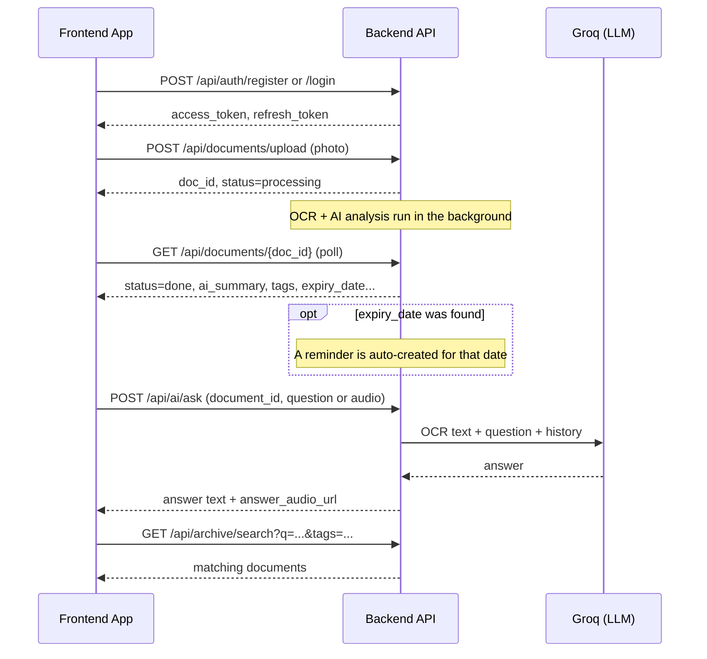

# Sahelha — Frontend Integration & Flow Guide

This document explains, end to end, what the app does, how the pieces fit
together, exactly which API calls the frontend should make and in what
order, what can go wrong, and how to verify the backend is healthy before
building against it. It's written so both engineers and non-technical
stakeholders can follow it.

---

## 1. What this app does (plain-language overview)

Sahelha helps someone deal with Egyptian government paperwork without
needing to read or understand it themselves.

1. The user **takes a photo** of a document (national ID, birth certificate,
   passport, etc.) in the app.
2. The backend **reads the text out of the image** (OCR), then sends that
   text to an AI model that **summarizes it in plain Arabic**, figures out
   what *kind* of document it is, and pulls out the important bits — names,
   dates, amounts, and especially an **expiry date** if there is one.
3. If there's an expiry date, the app **automatically schedules a reminder**
   so the user gets a push notification before it lapses.
4. The user can **ask questions about the document out loud** ("What's the
   ID number on this?") and get a spoken answer back — the AI answers using
   the actual text of *that* document, and remembers the conversation so
   far.
5. All processed documents land in a **searchable archive** — the user can
   search in natural language ("عقد الإيجار", "شهادة الميلاد") and filter by
   tags, or generate a **QR code** to let someone else pull up a shared copy.

Nothing here requires the user to type or read fluently — every text result
also has a voice/audio counterpart.

---

## 2. The end-to-end flow



**Screens this maps to** (a suggested, not prescriptive, breakdown):

| Screen | Backed by |
|---|---|
| Login / Register | `POST /api/auth/login`, `POST /api/auth/register` |
| Home / "My Documents" list | `GET /api/documents/` |
| Camera / Upload | `POST /api/documents/upload` |
| Document detail (summary, fields, expiry) | `GET /api/documents/{id}` |
| "Ask about this document" (voice or text chat) | `POST /api/ai/ask` |
| Reminders list | `GET /api/reminders/`, `POST /api/reminders/`, `DELETE /api/reminders/{id}` |
| Archive / Search | `GET /api/archive/search` |
| Share via QR | `GET /api/archive/share/{doc_id}` |
| Settings → push notifications | `PUT /api/auth/fcm-token` |

---

## 3. Base setup for the frontend

- Base URL: wherever the backend is deployed (e.g. `https://<service>.onrender.com`), or `http://localhost:8000` locally.
- Every endpoint below except register/login requires an `Authorization: Bearer <access_token>` header.
- Interactive schema/docs are always live at `/docs` (Swagger) — use that to try requests by hand before wiring up UI.
- CORS only allows the origins listed in the backend's `ALLOWED_ORIGINS` env var — if the frontend gets CORS errors, that's the first thing to check with whoever runs the backend.

---

## 4. API reference

### Auth

**`POST /api/auth/register`**
```json
// request
{ "email": "user@example.com", "password": "at-least-6-chars", "full_name": "محمد", "phone": "0100..." }
// response 200
{
  "access_token": "...", "refresh_token": "...", "token_type": "bearer",
  "user": { "id": 1, "email": "user@example.com", "full_name": "محمد", "phone": "0100...", "created_at": "2026-07-13T..." }
}
```
`400` if the email is already registered or invalid.

**`POST /api/auth/login`**
```json
{ "email": "user@example.com", "password": "..." }
```
Same response shape as register. `401` on wrong credentials.

**`GET /api/auth/me`** (auth) → the `user` object above.

**`PUT /api/auth/fcm-token`** (auth) — call this once the app has a Firebase push token, so reminder notifications can actually be delivered.
```json
{ "fcm_token": "..." }
```

> There is no `/refresh` endpoint yet — the access token is valid for `ACCESS_TOKEN_EXPIRE_HOURS` (24h by default). When it expires, the frontend needs to send the user back to login. If you need silent refresh, flag it — it isn't built yet.

### Documents

**`POST /api/documents/upload`** (auth, `multipart/form-data`, field `file` = image)
```json
// response 200 — immediately, before processing finishes
{ "doc_id": 42, "status": "processing", "message": "Document received, processing started" }
```
Only `image/*` content types are accepted (`400` otherwise). OCR + AI analysis then run **in the background** — the frontend must poll `GET /api/documents/{doc_id}` (e.g. every 2–3s) until `status` becomes `"done"` or `"failed"`.

**`GET /api/documents/`** (auth) → list of documents, most recent first:
```json
[{
  "id": 42, "status": "done", "doc_type": "national_id",
  "ai_summary": "بطاقة تحقيق الشخصية لشخص يسمى...",
  "ocr_text": "raw OCR text...",
  "entities": { "name": "...", "address": "...", "governorate": "..." },
  "dates": ["..."], "amounts": [], "expiry_date": "2027-01-01",
  "tags": ["بطاقة تحقيق", "شخصية", "هوية", "مصرية"],
  "image_url": "/uploads/1/abcd1234.jpg", "created_at": "..."
}]
```

**`GET /api/documents/{doc_id}`** (auth) → same shape, single document. `404` if it doesn't belong to the caller.

**`DELETE /api/documents/{doc_id}`** (auth) → `{"message": "Deleted"}`. `404` if not found/not owned.

**Rendering note:** `image_url` is a relative path — prefix it with the backend's base URL to load it. `tags`/`dates`/`amounts`/`entities` are empty (`[]`/`{}`) while `status` is still `"processing"`.

### Voice

**`POST /api/voice/stt`** (auth, multipart, field `file` = audio, e.g. recorded `.wav`/`.m4a`)
```json
{ "transcript": "...", "language": "ar" }
```

**`POST /api/voice/tts`** (auth, JSON)
```json
{ "text": "النص المطلوب تحويله لصوت", "language": "ar" }
// response
{ "audio_url": "/uploads/1/tts_....wav" }
```

### AI Assistant — voice/text Q&A about a document

**`POST /api/ai/ask`** (auth, `multipart/form-data`)

Form fields:
- `document_id` (required) — which document to answer questions about; must belong to the caller.
- `session_id` (optional) — pass back the `session_id` from a previous call to continue the same conversation; omit it to start a new one.
- `question` (optional) — typed question text.
- `audio` (optional) — a recorded question instead of typed text.

Provide **either** `question` or `audio` (not neither). If `audio` is given, it's transcribed with Whisper and used as the question.

```json
// response 200
{
  "session_id": "5f2b6b0a-...",
  "question": "ايه تاريخ الانتهاء بتاع البطاقة؟",
  "answer": "تاريخ الانتهاء هو ...",
  "answer_audio_url": "/uploads/1/ai_....mp3"
}
```
`404` if the document doesn't exist/isn't the caller's. `400` if the document has no OCR text yet (still processing) or if neither `question` nor `audio` was sent.

> This is the real AI assistant. Don't use the older `/api/chat/message` endpoint for this feature — see §6.

### Archive / Search

**`GET /api/archive/search?q=<text>&tags=<tag1,tag2>`** (auth)
- `q` — free-text search over document type, AI summary, OCR text, and tags (real full-text search, not substring matching).
- `tags` — optional, comma-separated; when given, only documents containing **all** listed tags are returned.

Returns the same document shape as `GET /api/documents/`.

**`GET /api/archive/share/{doc_id}`** (auth)
```json
{ "qr_image_base64": "iVBORw0KG...", "share_url": "https://sahelha.app/view/42" }
```
`qr_image_base64` is a PNG you can render directly as `data:image/png;base64,<value>`.

### Reminders

**`GET /api/reminders/`** (auth) → list, soonest first:
```json
[{ "id": 3, "document_id": 42, "remind_at": "2026-12-25T09:00:00", "message": null, "sent": false, "created_at": "..." }]
```

**`POST /api/reminders/`** (auth) — for manual reminders not tied to auto-expiry:
```json
{ "document_id": 42, "remind_at": "2026-12-25T09:00:00", "message": "جدد البطاقة" }
```
`document_id` and `message` are optional; `remind_at` is required (ISO datetime).

**`DELETE /api/reminders/{id}`** (auth) → `{"message": "Deleted"}`.

> Reminders for a document's `expiry_date` are created **automatically** by the backend once OCR/AI analysis finishes — the frontend doesn't need to create those itself, only ones the user adds manually.

### Legacy / general endpoints (usually not needed by the main app)

These predate the authenticated document/voice/AI features and aren't tied
to a logged-in user. Keep them in mind only if the frontend needs a public
FAQ-style flow (services catalogue, nearby offices) without login:
`GET /api/services`, `GET /api/services/{id}/steps`, `GET /api/offices/nearby`,
`POST /api/document/analyze`, `POST /api/chat/message`. **Do not** use
`/api/chat/message` for the AI assistant feature — it's a canned
keyword-matched bot with no real AI and no document context; use
`POST /api/ai/ask` instead.

---

## 5. Error handling reference

| Status | Meaning | Typical cause |
|---|---|---|
| `400` | Bad request | Missing required field, wrong file type, document still processing (no OCR text yet), neither `question` nor `audio` sent to `/api/ai/ask` |
| `401` | Not authenticated | Missing/expired/invalid `Authorization` bearer token, or wrong login credentials |
| `404` | Not found | Wrong `doc_id`/`reminder_id`, or it belongs to a different user (ownership is enforced — a 404, not a 403, is returned to avoid leaking existence) |
| `500` | Server-side failure | Voice/AI service misconfigured (e.g. missing `GROQ_API_KEY`) or an unexpected pipeline error |
| `503` | Not ready | `/api/ready` reports the database isn't reachable |

All errors return `{"detail": "..."}` (FastAPI's default shape) — show `detail` in a toast/snackbar for a quick non-technical error message, but don't rely on its exact wording for UI logic (match on status code instead).

---

## 6. What was broken and what got fixed (changelog)

For context on why some of the above works the way it does:

- **AI assistant was non-functional.** The Groq-based Q&A service existed in code but nothing called it; the live chat endpoint was a hard-coded, keyword-matched bot with canned replies. **Fixed:** built the real `POST /api/ai/ask` endpoint wired to Groq with actual document context and conversation memory.
- **A session bug would have broken multi-turn conversations** even after wiring the assistant up — the code that created a new chat session inserted `NULL` as its ID instead of the newly generated one. **Fixed**, and sessions are now scoped per user+document so one user can never see another's conversation.
- **A duplicate/fake voice endpoint** (`/api/voice/transcribe`) returned a placeholder string ("Whisper isn't hooked up yet") and could confuse frontend integration against the real, working `/api/voice/stt`. **Removed.**
- **Archive search used substring (`LIKE`) matching**, not real search, and had no way to filter by tag. **Fixed** with a proper SQLite full-text-search (FTS5) index and a `tags` filter param.
- **The FTS5 index was silently empty** even after the fix above — a `COUNT(*)` check used to decide whether the index needed backfilling was misleading (SQLite can answer that count from the underlying documents table without the index actually containing anything). **Fixed** by checking the FTS index's own internal table instead; verified against the real database that search now actually returns results.
- **Tag filtering silently failed for any Arabic tag** — tags are stored as JSON with all non-ASCII characters escaped (e.g. `ب...`), so a raw SQL `LIKE '%tag%'` could never match Arabic text on disk. **Fixed** by comparing tags after parsing the JSON instead of as raw text.
- **CORS allowed every origin (`*`)**, which is fine for local dev but not for production. **Fixed:** now controlled by an `ALLOWED_ORIGINS` env var, defaulting to localhost only.
- **No way to actually deploy**: no Dockerfile, no `.env.example`, no README, and `requirements.txt` was saved as UTF-16 (which breaks `pip install` in a standard Linux container). **Fixed:** all added — see `README.md` for Render deployment steps.

---

## 7. Running it locally and verifying it works

```bash
python -m venv venv
venv\Scripts\activate            # Windows; use `source venv/bin/activate` on Mac/Linux
pip install -r requirements.txt
copy .env.example .env           # then set at least GROQ_API_KEY
uvicorn main:app --reload
```

Then, in order, confirm each piece is actually working:

1. **Server is up:** open `http://localhost:8000/docs` — you should see the full Swagger UI with every endpoint listed above.
2. **Database is reachable:** `curl http://localhost:8000/api/ready` → `{"status":"ready","database":"ok"}`.
3. **Auth works:** register a user via `/docs` or curl, confirm you get back `access_token`; call `GET /api/auth/me` with that token in `Authorization: Bearer ...` and confirm it returns the same user.
4. **Upload + processing pipeline works:** upload a real photo of an Arabic document via `POST /api/documents/upload`, then poll `GET /api/documents/{doc_id}` every couple of seconds until `status` flips from `"processing"` to `"done"` — confirm `ai_summary`, `tags`, and (if the document has one) `expiry_date` are populated.
5. **Reminder auto-creation works:** if step 4's document had an expiry date, `GET /api/reminders/` should now show an entry for it without you creating one manually.
6. **AI assistant works:** call `POST /api/ai/ask` with that `document_id` and a `question` — confirm you get back a non-empty `answer` and an `answer_audio_url` that's actually playable.
7. **Search works:** call `GET /api/archive/search?q=<a word from the document>` and confirm the uploaded document comes back; try adding `&tags=<one of its tags>` and confirm it still comes back, then try a tag it doesn't have and confirm it disappears.
8. **Voice round-trip works:** record a short Arabic clip, send it to `POST /api/voice/stt`, confirm the transcript looks right; send that transcript to `POST /api/voice/tts` and confirm the returned audio file plays.

If any step fails, check the server logs first — `GROQ_API_KEY` missing/invalid is the most common cause of AI-related failures (`analysis`/`/api/ai/ask` still work in a degraded heuristic mode without it, but quality drops noticeably).

### Running via Docker (closer to production)

```bash
docker build -t sahelha-backend .
docker run -p 8000:8000 --env-file .env sahelha-backend
```
Same verification steps as above, against `http://localhost:8000`.
